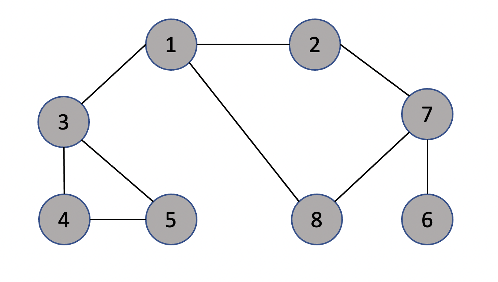

# algorithm flow
1. push the start node into the queue
2. pop from the queue and push all the unvisited adjacent node
and visit them
3. repeat step 2 until no more nodes have unvisited adjacent nodes
## graph
