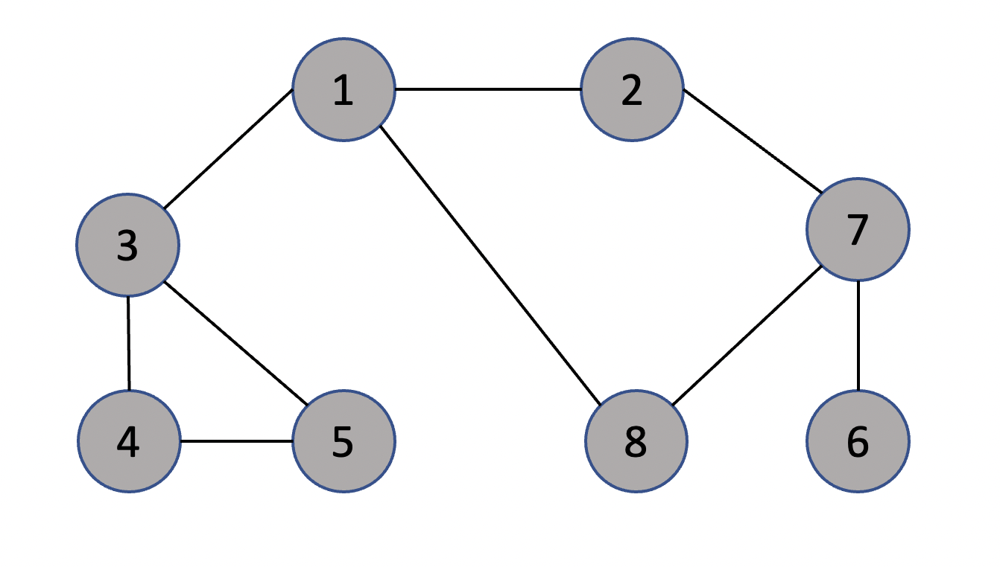

# algorithm flow
1. push the start node into stack
2. if the top node in the stack has one or more unvisited 
adjacent nodes, push them into the stack and visit them.  
If the top node doesn't have any unvisited adjacent node, 
pop the node from the stack
3. repeat step 2 until no more nodes have unvisited adjacent nodes
## graph

