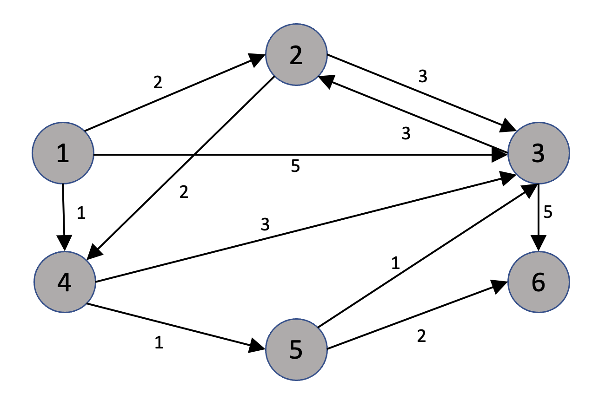

# algorithm flow
1. select the start node
2. initialize shortest distance table
3. select the node with shortest distance among unvisited nodes
4. evaluate the cost required to go to the other nodes from the selected node, and update the shortest distance table
## graph
