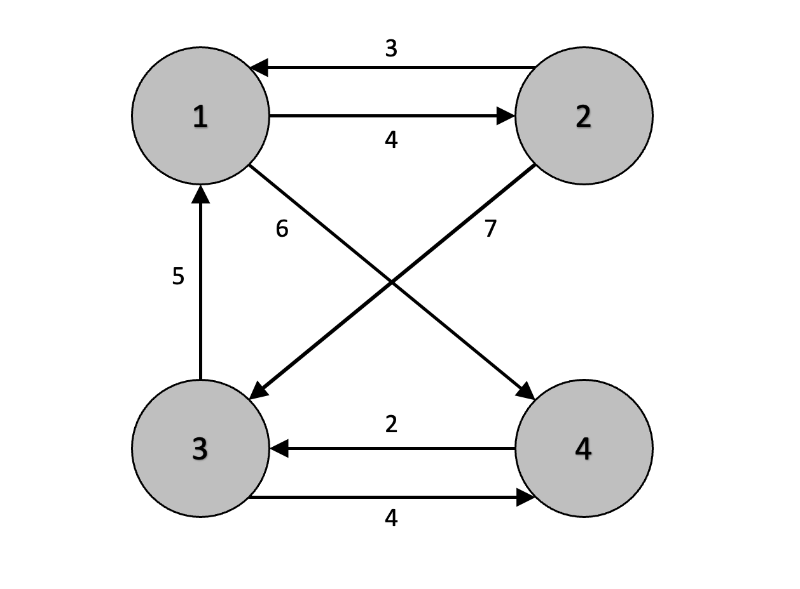

# algorithm flow
1. Initialize the 2-dimensional distance array (D\[1]\[2] holds the shortest distance from node 1 to node 2)
2. Select node 1 to begin(To evaluate the paths that go through node 1)
3. Compare the paths from all the nodes except for the selected node
    - Say current node number is **cur**, destination node **dest**, selected node **selected**
    - Assign the smaller of the two values, **D[cur, dest]**, **D[cur, selected] + D[selected, dest]**
4. Repeat step 2 and 3 until all the nodes have been selected
## graph
