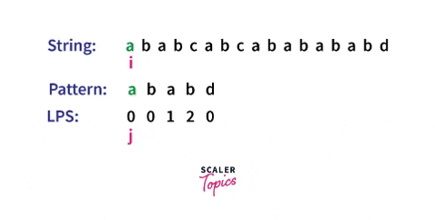

# algorithm flow
1. Create an LPS table(longest proper prefix that is also a suffix) for the pattern
   - ex) pattern: "ABXAB"
     - `lps[3]`: 1("A")
	 - `lps[4]`: 2("AB")
2. Set:
   - `i`: index for iterating the text
   - `j`: index for iterating the pattern
   - `pi`: the LPS table of the pattern
3. Start comparing `text[i]` with `pattern[j]`
   - if: `text[i] == pattern[j]`
	   - move on, (`i++, j++`)
   - else(`text[i] != pattern[j]`):
	   - if: they matched earlier(`j!=0`)
	      - start comparing again from where they matched(skip all the already-completed comparison)
	      - `j = lps[j-1]`
       - else: they didn't match earlier(`j==0`)
	      - just increment i and start comparing from the beginning
          - `i++`
   - if: the pattern is found(`j == length of the pattern`)
      - record the starting index where it was found
	      - `print(i-j)`
      - move on, start comparing from where they matched
	      - `j = lps[j-1]`
## graph
