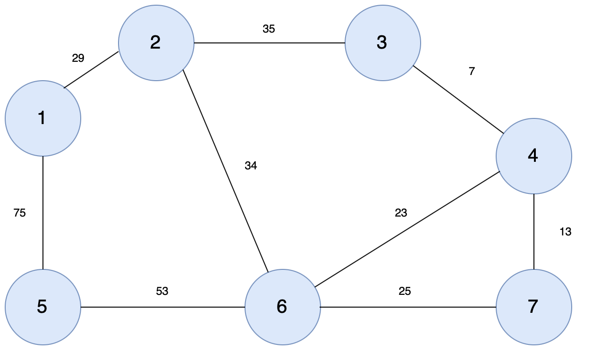

# algorithm flow
1. Sort the edges in ascending order of weights
2. For each edge starting from the one with the smallest weight, check if there's a cycle.
   - If there is a cycle: Don't include the current edge into the minimum spanning tree
   - If there is **not** a cycle: Include the current edge into the minimum spanning tree
3. Repeat step 2 for all the edges

## graph
